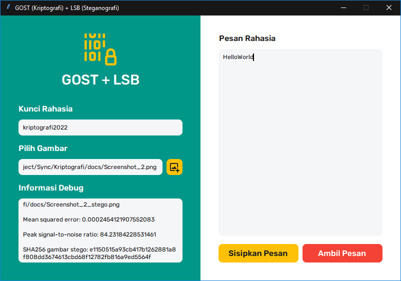

# GOST + XOR LSB with PRNG
Message hiding in images using GOST cryptography and (modified) LSB steganography. Please note that this is only a proof of concept! LSB is known to be very weak against image modifications such as cropping, rotation, and compression.

    

## Instructions
To inject message into an image:
1. Run `_main.py` file to start the GUI program
2. Input secret key (`Kunci Rahasia`) to be used as GOST encryption key and LSB PRNG seed
3. Choose cover image (`Pilih Gambar`) to be injected with message (only lossless format supported!)
4. Input secret message (`Pesan Rahasia`) to be injected into the cover image
5. Click `Sisipkan Pesan` (inject message), stego image will be produced
6. Check the MSE and PSNR values (from the `Informasi Debug`) to be sure

To extract message from an image:
1. Input secret key (`Kunci Rahasia`) to be used as GOST decryption key and LSB PRNG seed
2. Choose stego image (`Pilih Gambar`) for message extraction
3. Click `Ambil Pesan` (extract message), `Pesan Rahasia` (secret message) will be updated
5. If the key from step 1 is correct, then the secret message will be extracted successfully

## Sample Image
Cover image (left) was taken by Dejan Zakic from [Unsplash](https://unsplash.com/photos/hWD7n1m09GQ), stego image (right) was injected with message `HelloWorld`. Could you notice the difference?

    <table>
        <tr>
            <td style="text-align: center">Cover Image</td>
            <td style="text-align: center">Stego Image</td>
        </tr>
        <tr>
            <td style="text-align: center"></td>
            <td style="text-align: center"></td>
        </tr>
        <tr>
            <td style="text-align: center" colspan="2">MSE (Mean Squared Error): 0.000245 PSNR (Peak Signal-to-Noise Ratio): 84.231</td>
        </tr>
    </table>

## Other Note
The source code shared here is for a journal that I made. Use it freely, but don't make another journal based on it (with exact same algorithms).

## References
There are two main references that I use to make this program:
1. Taronisokhi Zebua, “GOST Algorithm (Encryption and Decryption),” Jan 2014, doi: 10.13140/RG.2.2.35980.21125
2. C. K. Deo, A. Singh, D. K. Singh, and N. K. Soni, “Developing a Highly Secure and High Capacity LSB Steganography Technique using PRNG,” Jul 2020, doi: 10.1109/ComPE49325.2020.9200077